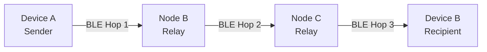
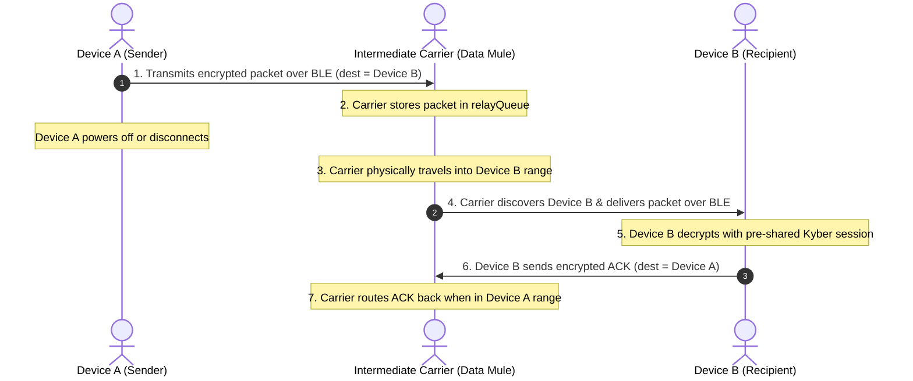

<div align="center">

# PQC Offline Mesh Chat
### Serverless, Decentralized, Post-Quantum Encrypted Bluetooth Mesh Messenger for Android

[](https://csrc.nist.gov/projects/post-quantum-cryptography)
[](https://www.rust-lang.org/)
[](https://www.bluetooth.com/)
[](../LICENSE)
[](https://developer.android.com)

<p align="center">
  <b>Communicate off-grid without Cellular, Wi-Fi, or Central Servers.</b><br>
  Built with NIST-standardized <b>Kyber-768 (ML-KEM)</b>, <b>Dilithium-3 (ML-DSA)</b>, and an autonomous <b>Bluetooth Low Energy (BLE) Multi-Hop Store-and-Forward Mesh</b>.
</p>

</div>

---

## Table of Contents
- [Threat Model and Motivation](#threat-model-and-motivation)
- [Key Features](#key-features)
- [Cryptographic Architecture](#cryptographic-architecture)
- [Mesh Networking and Data Mule Architecture](#mesh-networking-and-data-mule-architecture)
- [System Architecture](#system-architecture)
- [Repository Structure](#repository-structure)
- [Prerequisites and Build Guide](#prerequisites-and-build-guide)
- [Operational Guide](#operational-guide)
- [Battery and Background Optimization](#battery-and-background-optimization)
- [Security and Threat Defense Summary](#security-and-threat-defense-summary)
- [License](#license)

---

## Threat Model and Motivation

Traditional mobile messaging applications (Signal, WhatsApp, Telegram) depend on centralized internet infrastructure and classical public-key cryptography (RSA, ECDH). This creates two fundamental vulnerabilities:

1. **"Harvest Now, Decrypt Later" (HNDL)**: Adversaries can intercept and store classical encrypted traffic today, waiting for quantum computers to derive private keys using Shor's Algorithm.
2. **Infrastructure Failure and Censorship**: Natural disasters, grid blackouts, or network-level internet shutdowns immediately disable centralized messengers.

**PQC Offline Mesh Chat** mitigates both threats by providing an ad-hoc, peer-to-peer (P2P) mesh network that operates **100% offline**, secured by quantum-resistant mathematical lattices.

---

## Key Features

* **Hybrid Post-Quantum Key Exchange**: Combines classical **X25519 ECDH** with NIST-standardized **Kyber-768 (ML-KEM)** via compiled native Rust core bindings (`uniffi` / JNI).
* **Post-Quantum Digital Signatures**: Implements **Dilithium-3 (ML-DSA)** for public key authentication and message integrity.
* **Zero-Knowledge Multi-Hop Relay**: Intermediate nodes automatically route encrypted ciphertext across hops without having access to decryption keys.
* **Delay-Tolerant "Data Mule" Store-and-Forward**: Messages addressed to out-of-range peers are queued and automatically delivered when an intermediate device travels into range—even if the sender is powered off.
* **Single QR Code Out-of-Band Pairing**: Scan peer QR code once to exchange public keys and BLE node identities over GATT (`KEY_REQ` / `KEY_RESP`).
* **24/7 Foreground Service**: Persistent native Android daemon (`BLEMeshService`) keeps the BLE GATT server active in the background and when the screen is locked.
* **Real-Time Encrypted Delivery Confirmations**: Delivery acknowledgments (`ACK`) routed through the mesh both in the active UI and natively in the background.
* **Triple-Tap Emergency Panic Wipe**: Triple-tapping the header triggers native RAM zeroization, purges session keys, wipes outboxes, and restores an uninitialized state.
* **LZ4 Wire Compression**: Automatic payload compression for packets exceeding 100 bytes to optimize BLE MTU throughput.

---

## Cryptographic Architecture

```
                       ┌─────────────────────────────────────┐
                       │           Hybrid Handshake          │
                       │   (X25519 ECDH  +  Kyber-768 KEM)   │
                       └──────────────────┬──────────────────┘
                                          │
                                   HKDF-SHA256 (Salt, Info="mesh-chat-v1")
                                          │
                                          ▼
                       ┌─────────────────────────────────────┐
                       │     256-bit Master Session Key      │
                       └──────────────────┬──────────────────┘
                                          │
                                  AES-256-GCM + LZ4
                                          │
                                          ▼
                       ┌─────────────────────────────────────┐
                       │ End-to-End Quantum-Safe Ciphertext  │
                       └─────────────────────────────────────┘
```

---

## Mesh Networking and Data Mule Architecture

### 1. Direct Multi-Hop Routing
Packets contain routing metadata (`type`, `dest`, `sender`, `msgId`, `ttl`) and the opaque ciphertext.
* When an intermediate phone receives a packet:
  * If `dest == myNodeId`: Decrypts and notifies the user.
  * If `dest != myNodeId` and `ttl > 1`: Decrements `ttl - 1`, adds to `relayQueue`, and forwards over BLE GATT.



### 2. Delay-Tolerant "Data Mule" (Store-and-Forward)
If the destination device is out of direct radio range, intermediate mobile devices act as physical carriers ("Data Mules"):



---

## System Architecture

```
┌─────────────────────────────────────────────────────────┐
│                    React Native UI                      │
│                 (TypeScript / App.tsx)                  │
└───────────┬─────────────────────────────────┬───────────┘
            │                                 │
   JNI Native Module                 JNI Native Module
            │                                 │
┌───────────▼───────────┐         ┌───────────▼───────────┐
│     CryptoModule      │         │     BLEMeshModule     │
│       (Kotlin)        │         │       (Kotlin)        │
└───────────┬───────────┘         └───────────┬───────────┘
            │                                 │
       UniFFI / JNI                      UniFFI / JNI
            │                                 │
┌───────────▼─────────────────────────────────▼───────────┐
│                       Rust Core                         │
│  (Kyber-768, Dilithium-3, X25519, AES-256-GCM, LZ4)     │
└─────────────────────────────────────────────────────────┘
```

---

## Prerequisites and Build Guide

### Prerequisites
1. **Rust Toolchain**: `rustup` with Android targets:
   ```bash
   rustup target add aarch64-linux-android armv7-linux-androideabi i686-linux-android x86_64-linux-android
   ```
2. **Cargo NDK**: `cargo install cargo-ndk`
3. **Android Studio and NDK**: Android SDK 34+ and NDK version `26.1.10909125`.
4. **Node.js**: Node 18+ and Yarn/npm.

---

### Step 1: Compile Rust Cryptographic Engine and Bindings
```bash
# 1. Run unit tests
cd ../rust_core
cargo test

# 2. Build UniFFI Kotlin Bindings
cargo run --bin uniffi-bindgen generate --library target/debug/librust_core.dylib --language kotlin --out-dir ../PqcMeshChat/android/app/src/main/java/com/pqcmeshchat/uniffi/rust_core
cp ../PqcMeshChat/android/app/src/main/java/com/pqcmeshchat/uniffi/rust_core/uniffi/rust_core/rust_core.kt ../PqcMeshChat/android/app/src/main/java/com/pqcmeshchat/uniffi/rust_core/rust_core.kt
rm -rf ../PqcMeshChat/android/app/src/main/java/com/pqcmeshchat/uniffi/rust_core/uniffi

# 3. Cross-Compile .so libraries for all Android architectures
cargo ndk -t arm64-v8a -t armeabi-v7a -t x86 -t x86_64 -o ../PqcMeshChat/android/app/src/main/jniLibs build --release
```

---

### Step 2: Build the Android Release APK
```bash
cd ../PqcMeshChat
npm install

cd android
export JAVA_HOME="/Applications/Android Studio.app/Contents/jbr/Contents/Home"
./gradlew assembleRelease
```

The compiled APK will be at:
`android/app/build/outputs/apk/release/app-release.apk`

---

### Step 3: Install via ADB
```bash
adb install -r app/build/outputs/apk/release/app-release.apk
```

---

## Operational Guide

1. **Startup**: Open the app on two or more Android devices. BLE Mesh advertising and peer discovery start automatically.
2. **Pairing (Single QR Scan)**:
   * Device A selects the QR display icon in the header to show its public key QR code.
   * Device B opens the camera scanner and scans Device A's screen.
   * Device B derives the shared key and transmits a `KEY_REQ` packet back to Device A over BLE.
   * Both devices establish the connection simultaneously.
3. **Messaging**:
   * Send messages instantly. If the peer is temporarily unreachable, messages queue in the Outbox and auto-flush on reconnection.
   * Delivered messages display delivery confirmations upon receipt of an encrypted ACK.
4. **Emergency Panic Wipe**:
   * Triple-tap the header to immediately wipe all private keys, zeroize RAM, clear outboxes, and return to an uninitialized state.

---

## Battery and Background Optimization

Because Android OS power management (Doze Mode) can suspend background BLE radios after extended idle periods, follow these recommended settings:

* **Devices with Custom Battery Optimizers**:
  * App Info -> Battery Saver / Battery Usage -> Select **"No Restrictions"** (or **"Unrestricted"**).
  * Enable **"Autostart"** (where available).
  * Lock the application card in the Recent Apps window to prevent background termination on task clearance.
* **Standard AOSP / Stock Android Devices**:
  * App Info -> App Battery Usage -> Select **"Unrestricted"**.

---

## Security and Threat Defense Summary

| Threat / Attack Vector | Mitigation in PQC Mesh Chat |
| :--- | :--- |
| **Quantum Computing (Harvest Now, Decrypt Later)** | NIST **Kyber-768 (ML-KEM)** lattice-based key encapsulation. |
| **Man-in-the-Middle (MITM) Attacks** | Out-of-band QR code verification + **Dilithium-3 (ML-DSA)** signatures. |
| **Untrusted Intermediate Relay Nodes** | End-to-end **AES-256-GCM** encryption; relay nodes only inspect routing envelopes. |
| **Replay Attacks** | In-memory and native deduplication table (`seenMsgIds`) drops duplicate packet IDs. |
| **Physical Device Seizure** | **Triple-Tap Panic Wipe** zeroizes native RAM buffers and deletes persistent keys. |
| **Network Outages and Internet Censorship** | **100% Offline** peer-to-peer Bluetooth Low Energy mesh routing. |

---

## License
This project is licensed under the **MIT License** - see the [LICENSE](../LICENSE) file for details.
